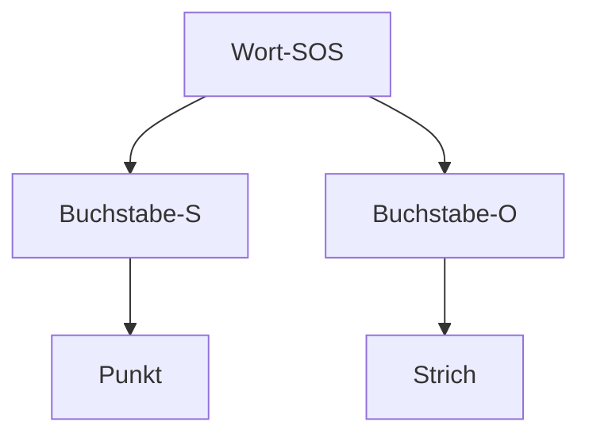

# Werkstättenprotokoll `23.10`

| Titel | Daten |
|---------|-----------------------------------|
| Einheit | `23.10` |
| Inhaltsübersicht | Ampellicht mit ESP32 steuern; Dimmen und Morsen einer Lampe via ESP32 |
| Stunden (Einheiten) | `7` |
| Fachlehrer | `Martin GIMPL` |
| Werkstätte | `EMC` |

# Inhalt

1. **Ampelschaltung**
   - Ziel: Eine funktionierende Ampelschaltung nach österreichischen Anforderungen
   - Umsetzung
     1. Schaltplan erstellen mit easyEDA
     2. Schaltung berechnen
     3. Prototypen mit der Hilfe des Steckbretts schaltplangetreu aufbauen
     4. Mikrocontroller (ESP32) programmieren
2. **Übung mit einem Feldeffekttranistor (MOSFET)**
   - Ziel: Eine Lampe mit einem Taster ein und aus zu Schalten
3. **Eine Lampe dimmen**
   - Ziel: Eine Lampe auf und ab zu dimmen
4. **Mit einer Lampe morsen**
   - Ziel: Mit einem möglichst schlanken und übersichtlichen Code SOS zu morsen (via Lichtsignal)

# Protokoll

## Ampelschaltung

Ziel der Ampelschaltung war es, eine Ampelschaltung umzusetzen, welche nach den österreichischen Anforderungen schaltet.

### Schaltplan

Der erste Schritt war, einen funktionierenden Schaltplan mit easyEDA umzusetzen.

> [!NOTE]
> EasyEDA hat folgende Vorteile im Vergleich zu anderen EDA's:
> 1. Direkte Anbindung zu JLCPCB
>    - Man kann dadurch direkt Leiterplatten von der Software via JLCPCB fertigen lassen
>    - Libary welche alle aktuellen Bauteile verfügbar hat (Via Rechtsklick kann auch das Datenblatt angezeigt werden)
> 3. Kostenlos für alle Geräte (und im Web) verfügbar
> 4. MultiSIM ähnliche Simulationstools


Entstanden ist folgender Schlatplan:


> [!TIP]
> Am Schaltplan haben wir den Mikrocontroller und die Schaltung mit einem `Netzanschluss` verbunden. Dies unterstützt eine bessere Übersicht am Schaltplan.

Zu allen Entscheidungen weshalb der Schaltplan so aufgebaut ist, gehe ich in dem Unterpunkt **Übung mit einem Feldeffekttranistor (MOSFET)** ein.

### Berechnung

Da die Lampe bereits einen Innenwiderstand verbaut hat, ist dieser Punkt überfällig.

### Programmierung


```c++
#include <Arduino.h> // Importieren der Arduino Libary

#define GREEN_BULB 25 // Für eine bessere Übericht wurde der verwendete Pin D25 deklariert

void setup() {
  pinMode(GREEN_BULB, OUTPUT); // Pin als Output deklarieren
}

void loop() {
  digitalWrite(GREEN_BULB, HIGH); // Zum blinken bringen
  delay(50);
  digitalWrite(GREEN_BULB, LOW);
}
```

> [!IMPORTANT]
> Achte immer darauf die Pins mit dem Befehl `#define xy 0` zu deklarieren. Es handelt sich hier um einem Pre-Compiler-Befehl, welche die Zeichenfolge `xy` mit dem Wert `0` ersetzt.

## Übung mit einem Feldeffekttranistor (MOSFET)

> [!NOTE]
> Der `MOSFET` ist eine Art Transistor, welche im Gegensatz zum bekannten `NPM-Transistor` mit angelegter Spannung schaltet und durchaus schneller im Schaltvorgang ist. Dies macht ihn in der Mikrocontrollertechnik zu einem relevanten Bauteil, da Mikrocontroller digital immer über Spannung kommunizieren.

Wir bauten eine einfache Tasterschaltung, die mit der Hilfe eines `MOSFET`'s eine Lampe ein und aus schaltet.

Entstanden ist folgender Schlatplan:


> [!WARNING]
> Wichtig zu beachten ist hier der Pull-Down Widerstand (120k), welcher essenziell für das Funktionieren dieser Schaltung  ist. Der Pull-Down Widerstand ist in den Protokollen vom Fachlehrer Martin BÖHM beschrieben.

## Eine Lampe dimmen

Genauere Informationen sind in den Protokollen vom Fachlehrer Martin BÖHM zu finden.

Der Code:

```c++
// Libary -> dimmen.h

#include <Arduino.h>

void switchDimmingOn(int port)
{
  for (int i = 1000; i > 0; i--)
  {
    digitalWrite(port, HIGH);
    delayMicroseconds(i);
    digitalWrite(port, LOW);
    delayMicroseconds(1000 - i);
  }
}

void switchDimmingOff(int port)
{
  for (int i = 1000; i > 0; i--)
  {
    digitalWrite(port, LOW);
    delayMicroseconds(i);
    digitalWrite(port, HIGH);
    delayMicroseconds(1000 - i);
  }
}
```
## Mit einer Lampe morsen

Bevor wir mit dem programmieren starteten, machten wir uns Gedanken zu dem Code Struktur:



Anschließend programmierten wir unsere eigene Libary `morsen.h`:

```c++
// Libary morsen.h

#include <Arduino.h>

void morsenPunkt(int port) {
    digitalWrite(port, HIGH);
    delay(500);
    digitalWrite(port, LOW);
    delay(250);
}

void morsenStrich(int port) {
    digitalWrite(port, HIGH);
    delay(1500);
    digitalWrite(port, LOW);
    delay(250);
}

void morsenCharacterS(int port) {
    for (int i = 0; i < 3; i++) {
        morsenPunkt(port);
    }
}

void morsenCharacterO(int port) {
    for (int i = 0; i < 3; i++) {
        morsenStrich(port);
    }
}
```

Welche wir dann im Main-File `main.cpp` aufrufen konnten:

```c++
#include <Arduino.h>
#include <morsen.h>

#define GREEN_BULB 25

void setup()
{
  pinMode(GREEN_BULB, OUTPUT);
}

void loop()
{
  morsenCharacterS(GREEN_BULB);
  morsenCharacterO(GREEN_BULB);
  morsenCharacterS(GREEN_BULB);

  delay(5000);
}
```